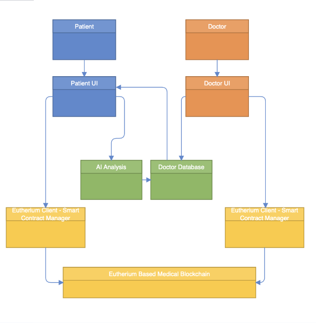
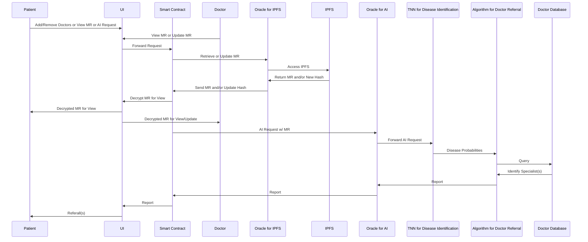

# F23_HealthChain

## Project Description

HealthChain aims to create a framework for standardizing personal health data using blockchain technologies and allow for long-term health data analytics through generative AI to allow for objective referral information.

### AI component

- Data: Synthea is a free open-source software that allows for the generation of synthetic patient medical records that are reflective of actual records, allowing training on large synthetic datasets
- Considering the sparse time-series nature of medical records (visits can be rare, inconsistent, and with variable observations), a sequential model with an attention mechanism like a transformer seems like a logical choice to navigate the inconsistent data: important observations can be recognized at different times for different patients
  - Due to sparsity, time-steps may have to be aggregates of visits, and/or patients with limited data may need to be excluded  
  - Adding engineered/derived features could be useful e.g. age from visit date and birthdate, or rate of observation increase/decrease over time
- AI trains on synthetic patients with binary cross-entropy for classification so that it can predict likelihoods of diseases in patients
- Disease probabilities are passed to an algorithm for querying a database of doctors: specializations, ratings etc. would be utilized to determine referrals

### Blockchain component

- Permissioned Blockchain: The blockchain will be a permissioned blockchain. The medical records need to be associated with the patients and doctors need to be verified to ensure the safety of the patients.
- Oracle:
  - We will need an oracle to fetch the medical records from an off-chain database as we do not want the medical records to be stored on the blockchain for fear of privacy issues.
  - We’ll also need another Oracle to communicate with the AI models
- The blockchain would serve as a governing factor to control permissions to edit and view patient data
- Patients would be able to allow doctors to edit personal data. 
- Patients would also be able to remove doctor permission once they saw fit
- The blockchain would consist of a series of smart contracts to allow this functionality to persist as well as supporting backend capabilities through the usage of maps primarily

## High-Level Component Diagram

## Sequence Diagram

